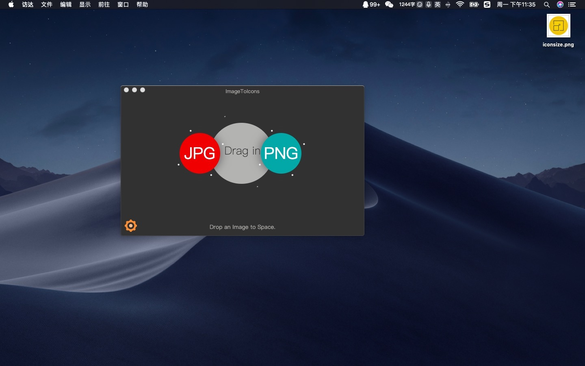
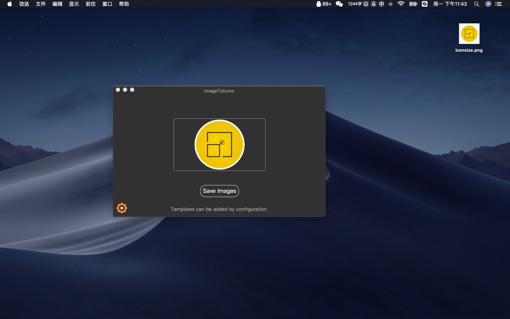
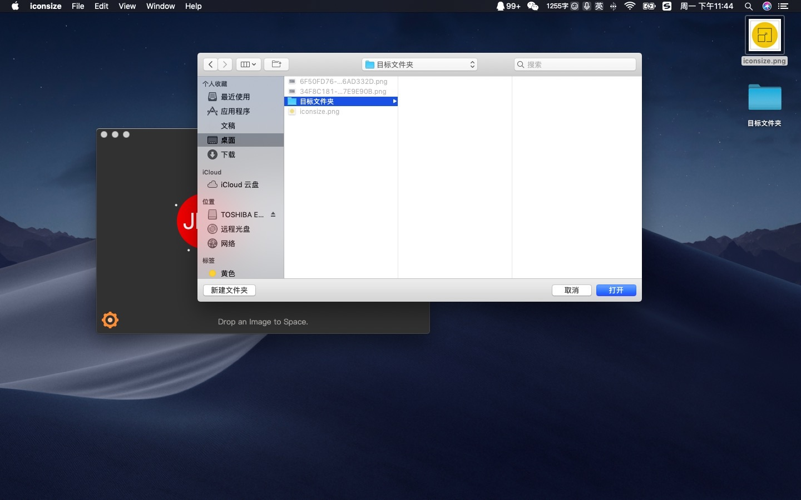
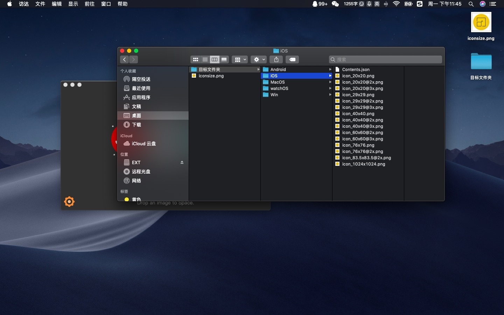
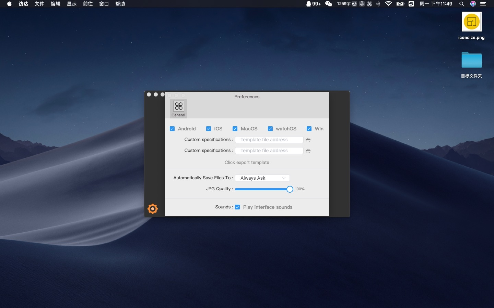

# JustWrite 

 

一款定位于快速批量制作指定大小的图片工具。

快速掌握Electron开发技巧，实战项目扥你来学习[实战：Electron开发仿 图标生成 工具类桌面应用](https://gitbook.cn/new/gitchat/activity/5de687898a4a7d7033bb51d0)！

如果帮助到你了，请帮忙点亮[Github](https://github.com/LuoYaoSheng/iconsize)右上角小星星，这将是我持续更新的动力！

## 功能

- [x] 批量生成Android、iOS、Mac、Windows的要求的图片

- [x] 自定义生成位置

- [x] 通过模板文件自定义批量指定图片

- [x] 播放音效

## 下载 mac、window、linux 客户端

Github：<https://github.com/LuoYaoSheng/iconsize/releases>

Gitee：<https://github.com/LuoYaoSheng/iconsize/releases> 

## 预览

## 鸣谢

暂无

## 反馈

新项目难免有Bug，我也只是在Mac平台使用，Win平台有Bug欢迎反馈告知！24小时之内修复！

唯一Bug反馈建议地址：<https://github.com/LuoYaoSheng/iconsize/issues>

## About

Blog：<https://weibo.com/u/3319790374>

Email：[1034639560@qq.com](1034639560@qq.com)

Github：<https://github.com/LuoYaoSheng>

交流QQ群：445455356

如果帮助到你了，请不吝赞赏！谢谢！

## 安装步骤

克隆示例项目的仓库

$ git clone https://github.com/LuoYaoSheng/iconsize.git

进入这个仓库

$ cd iconsize

安装依赖并运行

$ npm install && npm start

## 如何将图片转成icns

安装icoutils

$ brew install icoutils

进入生成文件夹

$ cd objectDir

文件夹重命名

$ mv MacOS MacOS.iconset

通过iconutil生成

$ iconutil -c icns MacOS.iconset -o mac.icns

## 如何打包

安装electron-builder

$ npm install electron-builder --save-dev

执行

$ npm run dist